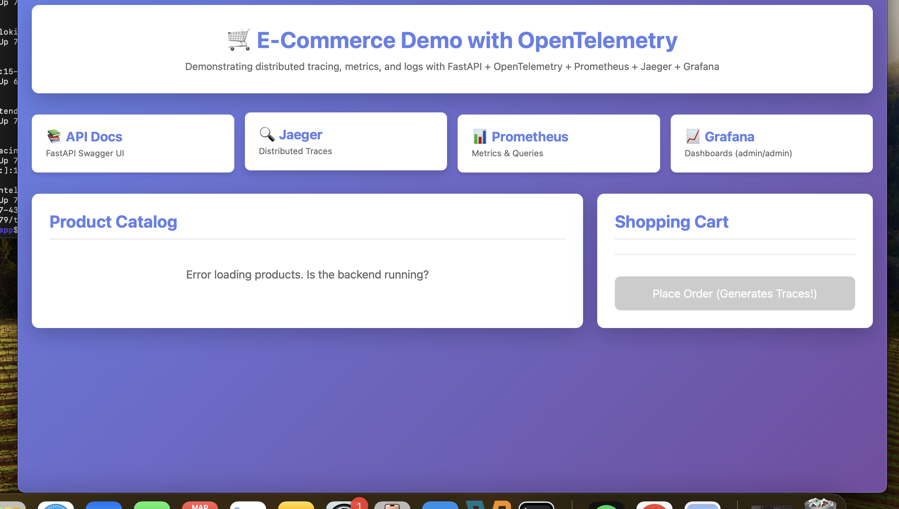
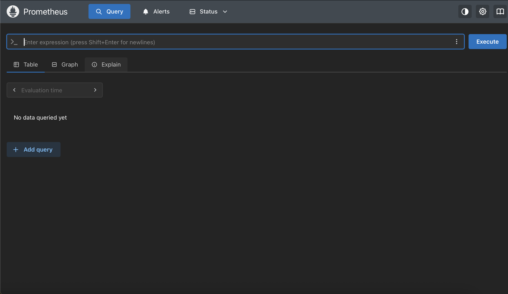
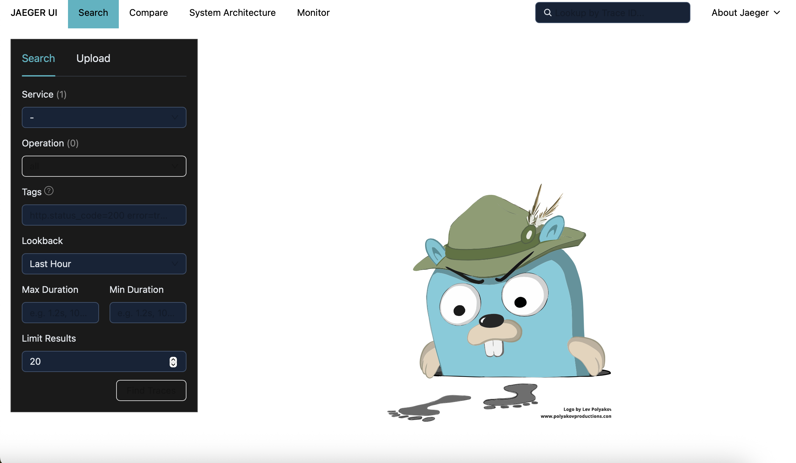

# E-Commerce Observability Platform — Ansible Deployment

## About The Project
This is a production-grade E-Commerce application that goes beyond 
shopping. It tracks and monitors customers, items, and transactions 
in real time using a full observability stack.

## Observability Stack
| Tool | Purpose |
|------|---------|
| FastAPI | Python backend — the core application |
| Prometheus | Collects and stores metrics |
| Grafana | Unified dashboard for all monitoring data |
| Jaeger | Tracks the full journey of every request |
| Loki | Stores and indexes application logs |
| Promtail | Collects logs from all containers |
| PostgreSQL | Application database |

## How I Deployed It
I used **Ansible** to automate the entire deployment process.
All application components are containerised with Docker and 
orchestrated using Docker Compose.

## Ansible Playbook Breakdown
The playbook (`deploy.yml`) contains 4 tasks:

1. **Install Docker** — Sets up the container engine on the server
2. **Install Docker Compose** — Enables running all containers together
3. **Clone the repository** — Pulls the latest code from GitHub
4. **Start the application** — Runs all 9 containers with one command

## How To Run
```bash
ansible-playbook -i inventory deploy.yml --ask-become-pass
```

## Screenshots

### Grafana Dashboard


### Prometheus


### Jaeger


### Frontend
## Screenshots
[Add screenshots here]

## Author
Ada014-Dev
